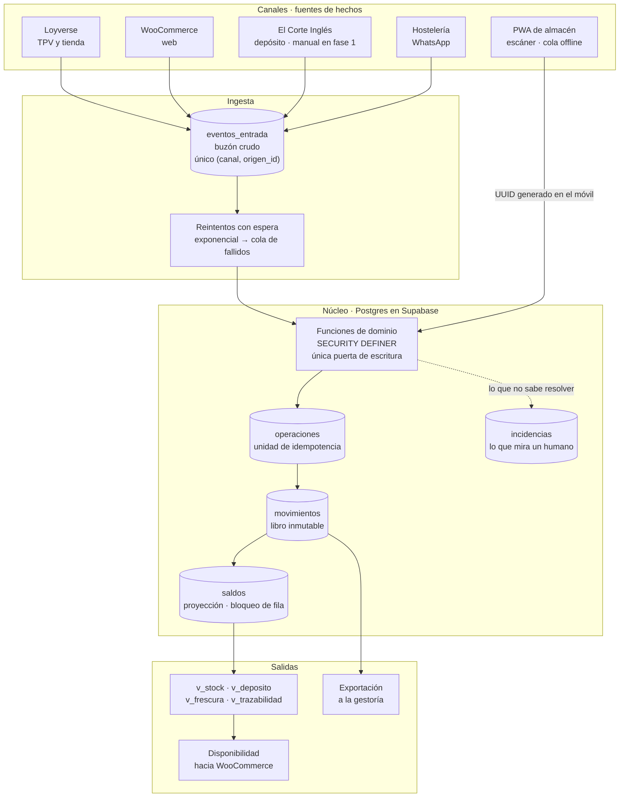

# Arquitectura

## El problema que resuelve

Cuatro canales de venta y ninguna fuente de verdad. El stock se consolida a
mano en una hoja de cálculo, así que hay descuadres y trabajo administrativo
diario. La solución no es otro sitio donde apuntar cosas: es **un maestro
único al que cada canal escribe solo**.

## La idea en una frase

**El stock no se guarda: se deriva.** Hay un libro de movimientos que solo
admite inserciones, y las existencias son su suma. Un número que no cuadra
siempre se puede explicar remontando los apuntes que lo produjeron.

## Flujo de datos

## Las cinco decisiones que sostienen el diseño

### 1 · El libro es inmutable de verdad

`movimientos` tiene disparadores que rechazan `UPDATE`, `DELETE` y `TRUNCATE`.
No es una convención que alguien romperá con una consulta a las nueve de la
noche: es una propiedad de la base. Corregir es anotar un `AJUSTE`, y el
descuadre queda registrado con su fecha y su responsable en lugar de
desaparecer.

`saldos` es una proyección derivada que mantiene un disparador. Existe por una
razón concreta y no por comodidad: **es la fila que se bloquea** para
serializar dos ventas simultáneas del mismo lote. `app.recalcular_saldos()`
la reconstruye desde el libro y tiene que dar siempre lo mismo;
`app.verificar_saldos()` es la sonda que debe devolver cero filas.

### 2 · La no-negatividad es una restricción, no una comprobación

`saldos` lleva `check (cantidad >= 0)`. Dos ventas simultáneas del último
paquete no se resuelven leyendo el stock y decidiendo: la segunda espera al
bloqueo de la primera, vuelve a leer el valor ya confirmado y es la
restricción la que la rechaza. Verificado con 50 ventas en paralelo.

### 3 · La idempotencia tiene dos claves porque hay dos repeticiones

| Repetición real | Clave que la para |
|---|---|
| La PWA sube dos veces lo que grabó sin cobertura | `operaciones.operacion_id`, **generado en el móvil** |
| Loyverse o WooCommerce reenvían un webhook | único `(origen, origen_id)` |

Que el UUID lo ponga el móvil y no el servidor es lo que permite reintentar a
ciegas: la app no necesita llevar la cuenta de qué llegó.

### 4 · Escribir en el inventario solo se puede de una manera

Ni `movimientos`, ni `operaciones`, ni `saldos` tienen permiso de escritura
para nadie. La única vía son las funciones de dominio, que comprueban rol,
idempotencia y disponibilidad antes de tocar nada. No depende de que nadie se
acuerde de usar la capa correcta.

Los importes van en tablas separadas (`precios`) en lugar de en columnas de
`articulos`. Eso convierte un permiso por columna, que RLS no sabe expresar,
en un permiso por tabla, que sí: **el operario no recibe la fila**, no es que
la interfaz se la oculte.

### 5 · El lote se deduce del gesto físico, no de un formulario

Cuando una venta llega por webhook, nadie ha escaneado nada. La política es
por ubicación:

- **`LOTE_ACTIVO`** (tienda, furgoneta, web): consume el lote que dejó el
  último escaneo de reposición. Reponer la vitrina ya es un traslado
  escaneado; ese mismo gesto *es* la declaración. Si el lote activo no llega
  para la venta, el resto no se reparte en silencio: va a conciliación.
- **`FIFO`** (depósito de El Corte Inglés): el más antiguo con saldo. Es lo
  único posible donde sus tiendas mezclan lotes y reportan ventas agregadas.

## El régimen de depósito

Servir a El Corte Inglés **es un traslado, no una venta**: la mercancía cambia
de sitio y sigue siendo nuestra. La venta —y la salida definitiva del
inventario— ocurre cuando ECI reporta. Lo no vendido vuelve como traslado de
entrada.

`v_deposito` expresa el invariante como consulta: `servido − vendido −
devuelto = saldo`, con una columna `descuadre` que tiene que ser cero, más la
antigüedad para saber qué lleva demasiado tiempo fuera.

En la fase actual los tres apuntes se cargan a mano, porque ECI es una prueba.
El día que haya integración los escribirá el conector y **esta vista no
cambia**.

## Lo que la app no hace

**No emite documentos fiscales.** Loyverse y WooCommerce ya son emisores con
Verifactu, y las facturas de ECI y hostelería las emite la gestoría. La app
guarda la *referencia* al documento ajeno (`pedidos.documento_fiscal`) para no
duplicar registros ante la AEAT.

## Qué pasa cuando algo va mal

Nada se descarta en silencio y nada se inventa:

- **SKU sin mapear, stock insuficiente, lote sin resolver** → `incidencias`,
  con el canal y el evento que lo originaron.
- **Webhook que falla** → se reintenta con espera exponencial (1 min → ~4 h,
  ocho intentos) y acaba en la cola de fallidos, no en el olvido.
- **Venta de mostrador sin stock** → falla en el acto, antes de cobrar.
- **Venta de un canal externo sin stock** → se anota lo que había y la
  diferencia va a conciliación. Negarse no devolvería el café al estante:
  solo perdería el dato.

## Stack

| Pieza | Elección | Por qué |
|---|---|---|
| Base de datos | Supabase (Postgres) | Transacciones y bloqueo de fila, que es de lo que depende todo lo anterior |
| Despliegue | Vercel | Rutas de servidor y tareas programadas para los conectores |
| Interfaz | Next.js · PWA | El escáner tiene que funcionar sin cobertura en un mercado |
| Acceso | PIN → JWT firmado con el secreto de Supabase | Rápido con las manos sucias; RLS evalúa el rol del token |

El navegador no habla con Supabase: habla con las rutas de este servidor. Así
el control de acceso está en un único sitio.
